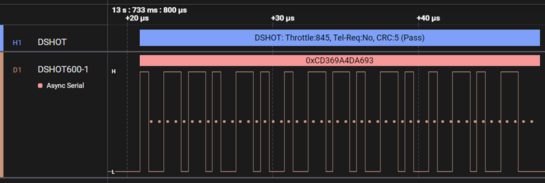
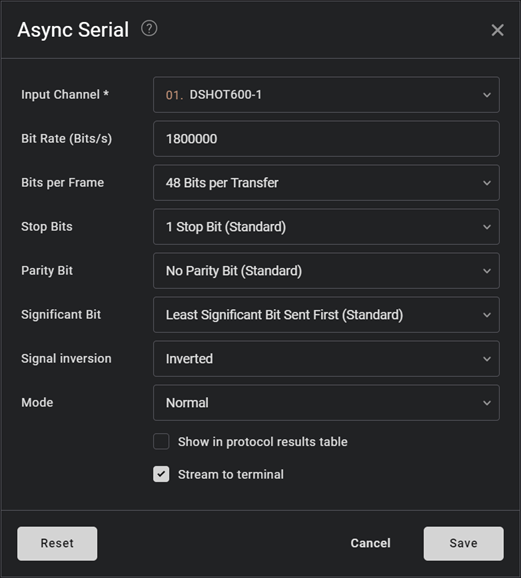

# The DSHOT 150, 300, 600 and 1200 Analyzer

  
## Introduction
DSHOT (Digital Shot) is a digital communication protocol used primarily in the field of brushless motor control, particularly in drones and other remote-controlled vehicles. It is designed to provide a more efficient and reliable method of communication between the flight controller and the electronic speed controllers (ESCs) compared to traditional analog signals.
#### Key Features of DSHOT:

**1. Digital Signal**: Unlike analog signals, DSHOT uses digital signals, which are less susceptible to noise and interference. This results in more accurate and reliable control of the motors.

**2. High Speed**: DSHOT operates at high speeds, allowing for faster and more precise control of the motors. This is crucial for the stability and responsiveness of drones.

**3. Bidirectional** Communication: DSHOT supports bidirectional communication, enabling the flight controller to receive telemetry data from the ESCs. This can include information such as motor RPM, temperature, and voltage.

**4. Error Detection**: The protocol includes error detection mechanisms, which help in identifying and correcting errors in the communication, thereby enhancing the reliability of the system.

Compatibility: DSHOT is widely supported by modern flight controllers and ESCs, making it a popular choice in the drone community.

#### Common Variants:

- DSHOT150: Operates at 150 kHz.
- DSHOT300: Operates at 300 kHz.
- DSHOT600: Operates at 600 kHz.
- DSHOT1200: Operates at 1200 kHz.

#### Applications:

##### DSHOT is primarily used in:

- Drones: For precise control of brushless motors, enhancing flight performance and stability.
- Remote-Controlled Vehicles: Including cars, boats, and other RC models that require accurate motor control.

In summary, DSHOT is a digital communication protocol that enhances the performance, reliability, and capabilities of brushless motor control systems, particularly in drones and other RC applications.

---

# Configuring the DSHOT Analyzer in Logic 2 (Saleae)

This guide provides step-by-step instructions to configure the DSHOT analyzer using Logic 2 by Saleae.

## Prerequisites

Ensure you have the latest version of Logic 2 installed and your DSHOT analyzer properly added.

## Setup Instructions

### 1. Configure Digital Channels

- Open the **Device Settings** pane.
- Select one or more **Digital** channels where the DSHOT signal will be captured.

### 2. Add an Async Serial Analyzer (Example below)

- Navigate to the **Analyzers** tab.
- Click **Add Analyzer** and select **Async Serial**.
- Set the **Input Channel** to the digital channel(s) chosen in Step 1.

### 3. Set Bit Rate

- In the **Async Serial** configuration, set the **Bit Rate (Bits/s)** to **three times (x3) the DSHOT frequency**.
  - For example, for DSHOT600, set the bit rate to `1800000`.

### 4. Configure Frame and Signal Options

- Set **Bits per Frame** to `48`.
- Enable **Inverted** under **Signal Inversion**.

### 5. Add the DSHOT Analyzer Analyzer

- Click **Add Analyzer** again and select your DSHOT analyzer.
- In the configuration window:
  - Choose the **Async Serial** analyzer (configured in Step 2) as the **Input Analyzer**.
- Click **Save** to apply the settings.

---

---
Your DSHOT analyzer is now configured and ready to interpret DSHOT signals within Logic 2.

  